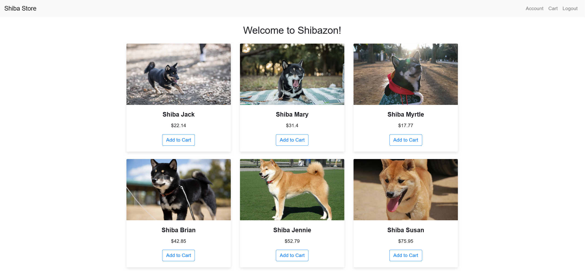

# ShibaZon

Welcome to ShibaZon, the Kubernetes deployed E-commerce store! This store was developed using Flask and is deployed on an EKS cluster on AWS, utilising an RDS database.

The aim of this projects was to get hands on experience with AWS services, and try out a Kubernetes related service. 
